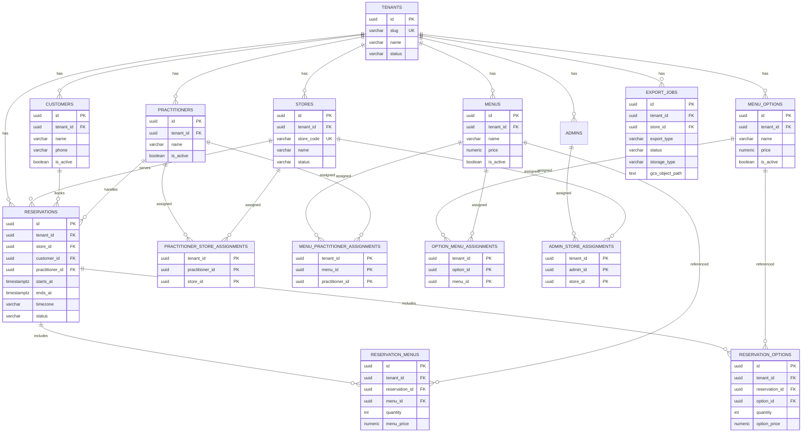

# DB V3 ER図（Cloud SQL OLTP）

`Cloud SQL(PostgreSQL)` 側の正規化スキーマ（V3）の中核だけを示した ER 図です。
分析系は `BigQuery raw/mart` に分離し、この図には含めません。

**注記**: CRM拡張テーブル（`tenant_rfm_settings`, `tenant_notification_settings`）と
SECURITY DEFINER 関数（`resolve_active_store_context`, `resolve_booking_link_token`）は
この図に含めていません。正本は migration ファイルを参照してください。

詳細なスキーマ定義（制約/RLS/FK 方針 / CRM拡張）は以下を参照:

- `docs/architecture/DB_V3_SCHEMA_DEFINITION.md`

## 制約ポリシー（100点品質の要点）
- 親テーブルは複合FK前提で `UNIQUE (tenant_id, id)` を持つ。
- 参照は原則 `FOREIGN KEY (tenant_id, xxx_id) -> parent(tenant_id, id)`。
- `reservations` は `CHECK (starts_at < ends_at)` と `EXCLUDE ... WHERE status NOT IN ('canceled', 'no_show')` を適用。
- 予約ステータス遷移は固定し、`canceled/no_show` になったときのみ同時間帯の再予約を許可する。
- RLS は `ENABLE + FORCE` を適用し、`app_user` は `NOBYPASSRLS` 前提。
- テナントコンテキストはアプリの全Repositoryでトランザクション内 `SET LOCAL app.current_tenant = ...` を必須にする。
- 多対多は配列ではなく assignment テーブルで表現する。
