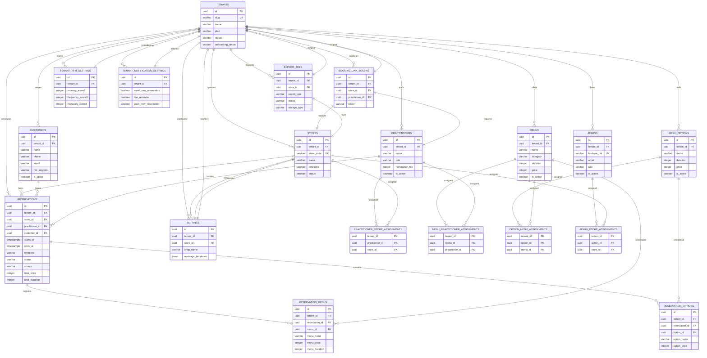

# DB V3 ER図（Cloud SQL OLTP）

この ER 図は v3-clean schema の主要業務テーブルと主要依存を示す overview である。全 28 tables の網羅表ではなく、exhaustive feature/table coverage と検証ステータスは `docs/architecture/DB_V3_CAPABILITY_MATRIX.md` を正本とする。

図に含まれるすべての FK/assignment は `DB_V3_SCHEMA_DEFINITION.md` で定義された tenant-safe FK 方針に従っている。
