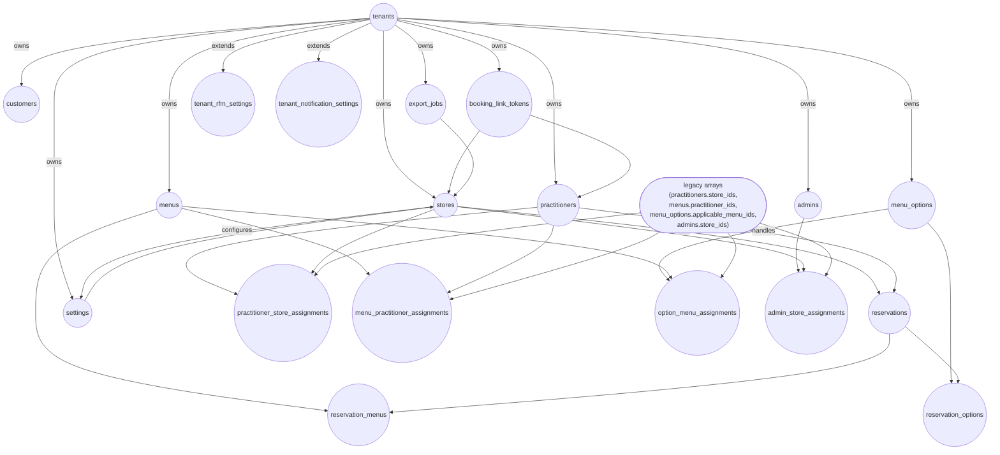

# DB V3 スキーマ依存 DAG（Mermaid graph TD）

この DAG は core masters → transactional → extension/integration に向かう主要依存方向を示し、legacy arrays から assignment テーブルへの cleanup 境界（`LEGACY_ARRAYS`）を注記している。全 table inventory と検証ステータスは `DB_V3_CAPABILITY_MATRIX.md` を正本とする。
