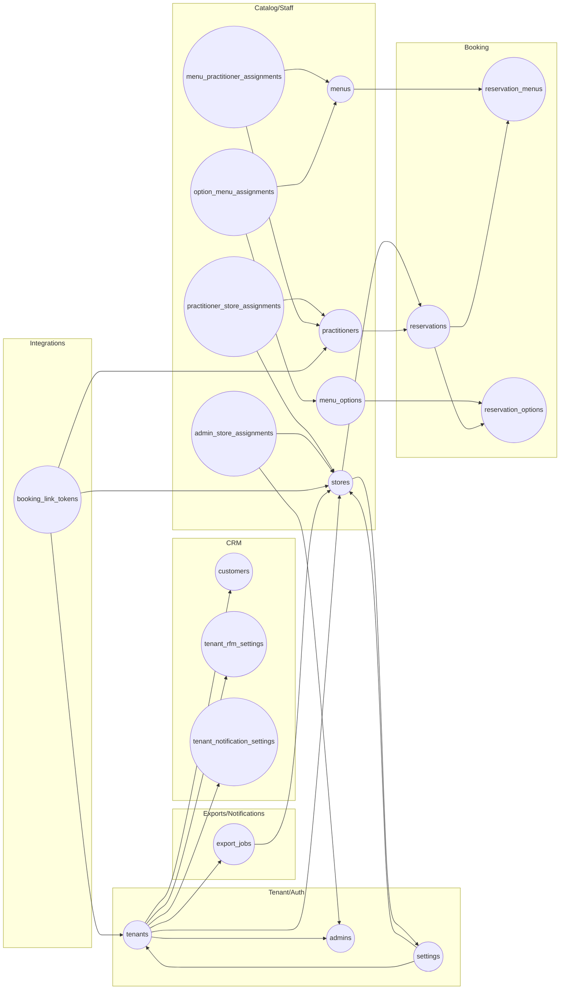

# DB V3 スキーマ領域図（Mermaid flowchart）

この図は主要なスキーマ領域をドメインごとに俯瞰する overview であり、全 table inventory の網羅表ではない。exhaustive coverage と verification status は `docs/architecture/DB_V3_CAPABILITY_MATRIX.md` を参照する。

クラスタは実装側でも使われる論理領域 `Tenant/Auth`, `Catalog/Staff`, `Booking`, `CRM`, `Integrations`, `Exports/Notifications` を反映し、各ドメインがどのマスター/トランザクションを抱えるかを示している。網羅確認は capability matrix を正本とする。
